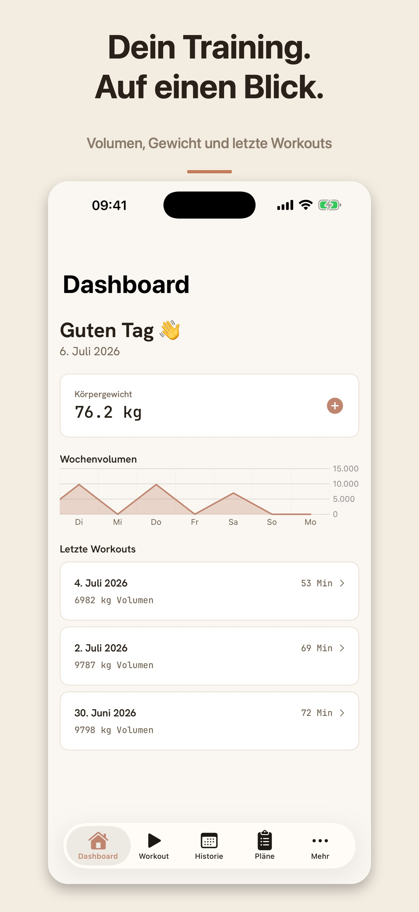
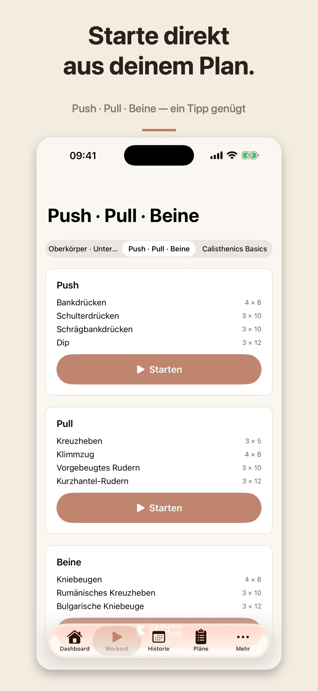
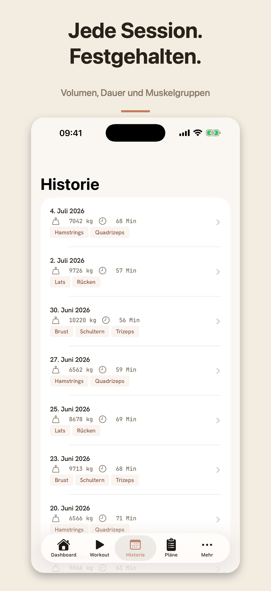
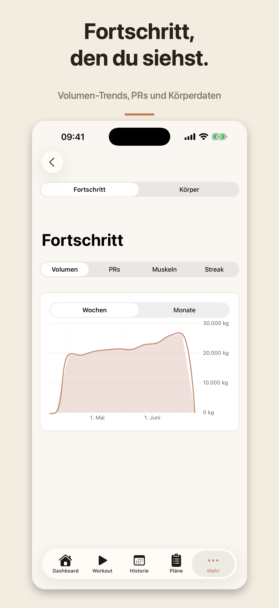
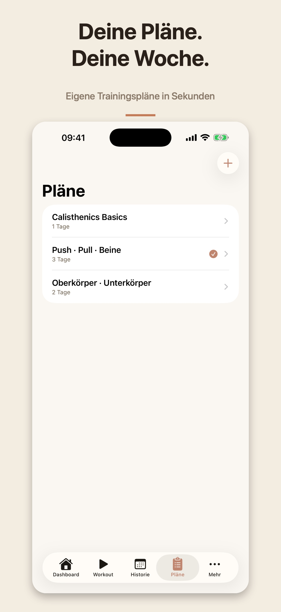
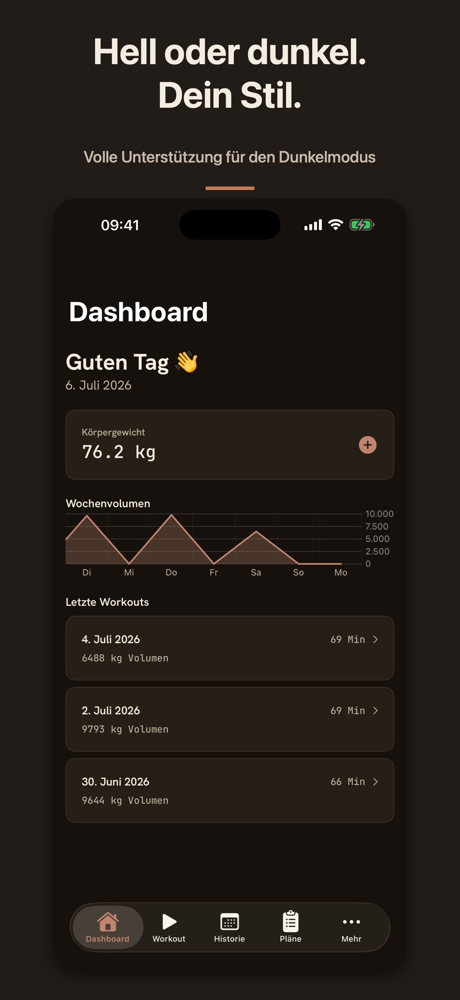

# TrainBook

**Dein Trainingstagebuch für iOS** — Krafttraining, Calisthenics, Cardio und Tabata in einer App. Komplett auf Deutsch, ohne Account, ohne Tracking. Deine Daten gehören dir: lokal auf dem Gerät, optional synchronisiert über deine private iCloud.

  
  
  

  
  
  

## Features

- **Workout-Tracking** — Sätze, Wiederholungen, Gewicht, RPE; Supersätze, Aufwärm- und Abkühlphasen
- **Calisthenics-Progressionen** — vom Dead Hang bis zum Einarm-Klimmzug, mit Schwierigkeitsfaktoren und Zusatzgewicht
- **Cardio & Tabata** — Distanz und Zeit, konfigurierbare Intervall-Timer mit Live Activity
- **Trainingspläne** — eigene Pläne mit Trainingstagen, Zielvorgaben und Ein-Tipp-Start
- **Fortschritt** — Volumen-Trends, PR-Erkennung mit Konfetti, Muskel-Heatmap, Streak-Kalender
- **Körpermaße** — Gewicht, Körperfett und Umfänge mit Verlaufsdiagrammen
- **Ruhe-Timer** — läuft im Hintergrund weiter, mit Benachrichtigung und Live Activity
- **Backup & Export** — vollständiger Export/Import der eigenen Daten
- **Hell & Dunkel** — warmes, eigenständiges Design in beiden Modi
- **126 Übungen** — kuratierte Übungsdatenbank plus eigene Übungen

## Technik

| | |
|---|---|
| Plattform | iOS 17+, iPhone |
| UI | SwiftUI |
| Persistenz | SwiftData mit CloudKit-Sync (private Datenbank, lokaler Fallback) |
| Diagramme | Swift Charts |
| Widgets | WidgetKit + Live Activities (ActivityKit) |
| Abhängigkeiten | keine — 100 % Apple-Frameworks |

## Datenschutz & Support

- [Datenschutzerklärung](docs/datenschutz.md)
- [Support](docs/support.md)

## Lizenz

© Jan Schneider. Alle Rechte vorbehalten.
